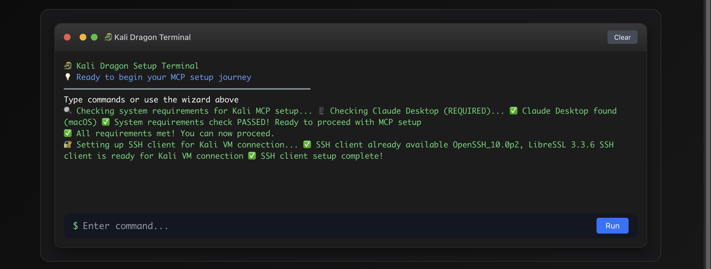
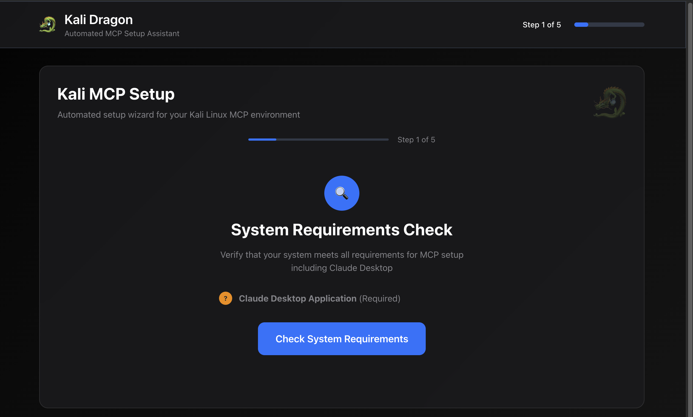
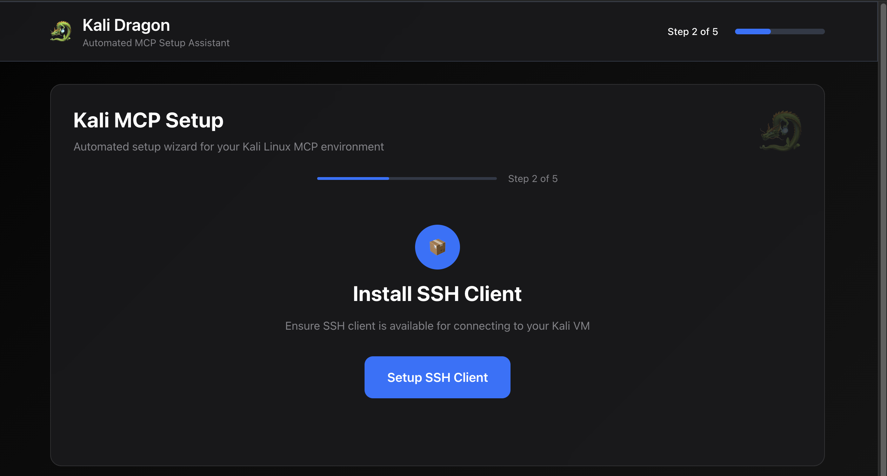
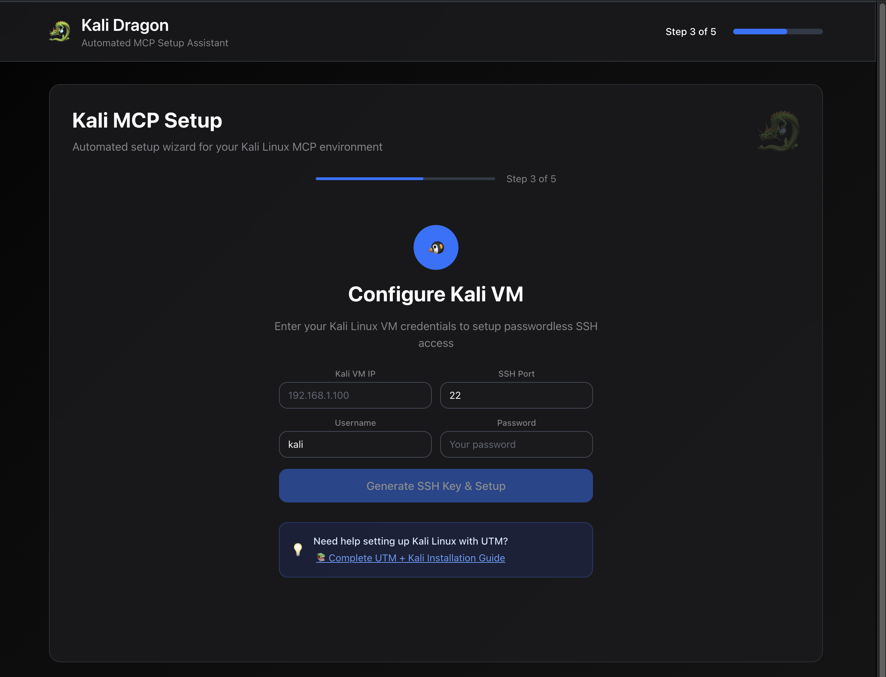

<div align="center">

# 🐉 Kali Dragon

> **Ultimate Kali Linux MCP Management Interface**  
> Modern web-based terminal for managing Kali Linux MCP setup with zero dependencies

[](https://opensource.org/licenses/MIT)
[](https://nodejs.org/)
[](https://github.com/HeyChristian/kali-dragon)
[](https://github.com/HeyChristian/kali-dragon/releases)
[](https://github.com/HeyChristian/kali-dragon)



**🎆 Beautiful Dark Mode Terminal | ⚡ Zero Dependencies | 🛡️ Security First**

</div>

## ✨ Features

### 🌟 **Modern Web Interface**
- **Dark Mode Terminal** - Authentic terminal experience with neon colors
- **No Dependencies** - Pure Node.js, no npm install required
- **Responsive Design** - Works perfectly on desktop and mobile
- **Real-time Command Execution** - Live terminal output with color coding

### 🚀 **Kali Linux MCP Management**
- **Automated Setup** - Guided setup process for Kali Linux MCP
- **System Check** - Comprehensive dependency verification
- **SSH Configuration** - Easy Kali VM connection setup
- **MCP Server Management** - Start, stop, and monitor MCP services

### 💻 **Terminal-First Design**
- **60vh Terminal** - Terminal takes center stage
- **Kali-style Prompts** - Authentic `┌─[dragon@kali]─[~]` styling
- **Command History** - Full command execution and output logging
- **Auto-focus** - Always ready for input

## 🎯 Quick Start

### 1️⃣ Clone Repository
```bash
git clone https://github.com/HeyChristian/kali-dragon.git
cd kali-dragon
```

### 2️⃣ Launch Kali Dragon
```bash
./setup.sh
```

That's it! The setup script will:
- ✅ Check Node.js installation
- ✅ Create project structure
- ✅ Start the web server
- ✅ Open browser automatically

## 📸 Screenshots

### **🎆 Modern Web Interface**
<div align="center">
  
  <p><em>Beautiful dark mode terminal with real-time command execution</em></p>
</div>

### **🔍 Step 1: System Requirements Check**
<div align="center">
  
  <p><em>Validates Claude Desktop installation and system compatibility</em></p>
</div>

### **🔐 Step 2: SSH Client Setup**
<div align="center">
  
  <p><em>Ensures SSH connectivity for Kali VM communication</em></p>
</div>

### **🐧 Step 3: Kali VM Configuration**
<div align="center">
  
  <p><em>Automated SSH key generation and VM connection setup</em></p>
</div>

## 📱 Key Features

### **🎨 Modern Interface**
- **Apple-style Dark Mode** with glassmorphism effects
- **Interactive Terminal** with authentic Kali styling
- **Real-time Command Execution** with colored output
- **Responsive Design** that works on all devices

### **⚙️ Automated Setup**
- **5-Step Wizard** for complete MCP configuration
- **System Validation** checks all requirements
- **SSH Key Management** with Ed25519 security
- **Error Recovery** with helpful suggestions

### **🔐 Security First**
- **No Dependencies** - Pure Node.js implementation
- **Secure Key Generation** for VM access
- **Input Validation** and sanitization
- **Branch Protection** for code integrity

## 🛠️ System Requirements

### **Required**
- **Node.js 14+** - Runtime for the web server
- **Modern Browser** - Chrome, Firefox, Safari, Edge

### **Optional (for full functionality)**
- **Python 3** - For MCP scripts
- **Docker** - For containerized services  
- **SSH Client** - For Kali VM connection
- **Kali Linux VM** - Target system for MCP setup

## 🎮 Usage Examples

### **Basic Setup**
```bash
# Start Kali Dragon
./setup.sh

# Opens browser at http://localhost:8000
# Click "START SETUP PROCESS" to begin
```

### **Manual Commands**
```bash
# In the terminal interface
$ python3 --version
$ docker --version
$ ssh -V
```

### **System Check**
```bash
# Use the System Check button or run manually
$ echo "🔍 Checking system requirements..."
$ which python3 && which docker && which ssh
```

## 📁 Project Structure

```
kali-dragon/
├── setup.sh                 # Main launcher script
├── web-wizard/              # Web interface
│   ├── server.js            # Node.js web server
│   ├── views/               # EJS templates (backup)
│   └── public/              # Static assets (backup)
├── kali_mcp_wizard.sh       # Original Kali MCP setup
├── README.md                # This file
└── LICENSE                  # MIT License
```

## 🎨 Design Philosophy

### **Terminal-First Experience**
- The terminal is the primary interface, not a side feature
- Authentic terminal styling with proper command prompts
- Real command execution with proper output formatting

### **Zero Dependencies**
- No npm install required - uses CDN resources
- Pure Node.js with only built-in modules
- Tailwind CSS and Alpine.js via CDN

### **Modern & Accessible**
- Dark mode optimized for long sessions
- Responsive design for all screen sizes
- Keyboard-friendly with auto-focus

## 🤝 Contributing

We welcome contributions! Please see our [Contributing Guidelines](CONTRIBUTING.md) for details.

### **Development Setup**
```bash
git clone https://github.com/HeyChristian/kali-dragon.git
cd kali-dragon
./setup.sh
```

### **Code Style**
- Use 4 spaces for indentation
- Follow existing code patterns
- Add comments for complex logic
- Test on multiple platforms

## 📜 License

This project is licensed under the MIT License - see the [LICENSE](LICENSE) file for details.

## 🙏 Acknowledgments

- **Kali Linux Team** - For the amazing security distribution
- **MCP Community** - For the Model Context Protocol
- **Tailwind CSS** - For the modern styling framework
- **Alpine.js** - For the lightweight reactivity

## 🐛 Support

- **Issues**: [GitHub Issues](https://github.com/HeyChristian/kali-dragon/issues)
- **Discussions**: [GitHub Discussions](https://github.com/HeyChristian/kali-dragon/discussions)
- **Documentation**: [Wiki](https://github.com/HeyChristian/kali-dragon/wiki)

---

<div align="center">

**🐉 Unleash the Dragon! ⚔️**

Made with ❤️ for the security community

</div>