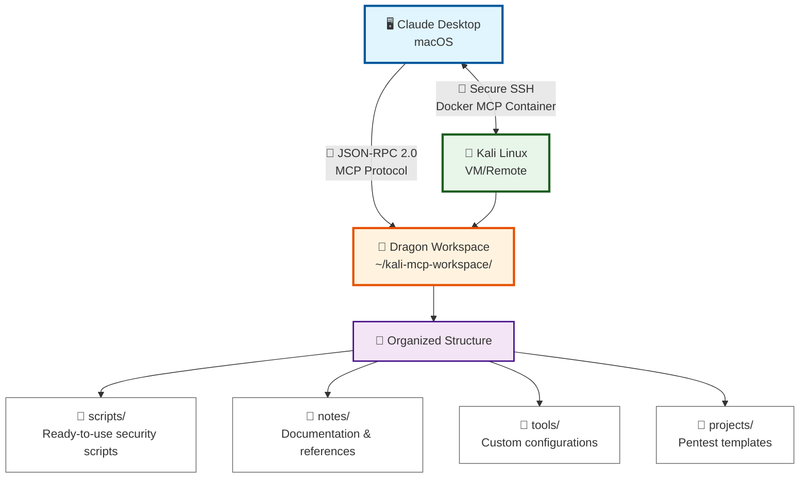

# 🐉 KALI DRAGON - THE ULTIMATE MCP TOOL

**The most powerful and complete Kali Linux MCP server automation tool ever created.**

Kali Dragon transforms your Kali VM into a fully accessible workspace through Claude Desktop with just SSH credentials. Zero Docker complexity, maximum security, complete automation.

## 🚀 One Command Setup

```bash
# First, make the script executable (one time only)
chmod +x kali-dragon.sh

# Interactive main menu
./kali-dragon.sh

# Direct options
./kali-dragon.sh --wizard    # Full automated setup
./kali-dragon.sh --clean     # Reset everything
./kali-dragon.sh --repair    # Fix issues
./kali-dragon.sh --guide     # Beginner's setup guide  
./kali-dragon.sh --help      # Complete documentation
```

**Just provide SSH credentials - Kali Dragon handles everything else!**

## ✨ What Makes Kali Dragon Ultimate?

### 🐉 **Dragon Powers**
- **🪄 Complete Automation**: SSH keys, workspace, Docker, Claude Desktop - ALL automated
- **🛡️ Built-in Repair**: Detect and fix configuration issues automatically
- **🧹 Smart Cleanup**: Remove all traces and start fresh with one command
- **📚 Interactive Help**: Complete documentation and troubleshooting built-in
- **🔧 Zero Dependencies**: No manual Docker setup, no complex configurations

### 📦 **What Gets Created**
- **🔑 SSH Authentication**: Secure key-based access to your Kali VM
- **🐳 Optimized Docker Server**: Lightweight, fast MCP server container
- **📁 Complete Workspace**: Tools, scripts, documentation, and examples
- **⚙️ Auto-Configuration**: Claude Desktop ready to use immediately
- **🧪 End-to-End Testing**: Validates everything works before you use it

### 🎯 **Security First**
- **🔒 Workspace Isolation**: All operations sandboxed in dedicated directory
- **⚡ Command Timeouts**: 30-second limits prevent runaway processes
- **📜 Ethical Guidelines**: Built-in documentation about responsible hacking
- **🚫 Command Filtering**: Dangerous operations blocked by design

## 📋 Prerequisites (Minimal)

**All you need:**
- 🍎 **macOS** (Intel or Apple Silicon)
- 🐧 **Running Kali Linux VM** (any platform: UTM, VMware, Parallels, VirtualBox)
- 🌐 **Network access** to the VM
- 🤖 **Claude Desktop** installed
- 🐳 **Docker** (Orbstack recommended, Docker Desktop works too)

**That's it!** Kali Dragon will:
- ✅ Create SSH keys automatically
- ✅ Install all needed software on Kali
- ✅ Build optimized Docker containers
- ✅ Configure Claude Desktop completely
- ✅ Test everything end-to-end

## 🏠 Dragon Architecture



## 🎮 Dragon Commands

### 🐉 **Interactive Menu (Recommended)**
```bash
./kali-dragon.sh
```
Shows beautiful menu with options:
- 🚀 **Full Setup Wizard** - Complete automated installation
- 🔧 **Repair/Fix** - Detect and fix issues
- 🧹 **Clean/Reset** - Remove everything and start fresh
- ❓ **Help** - Complete documentation

### ⚡ **Direct Commands**
```bash
./kali-dragon.sh --wizard     # Skip menu, go straight to wizard
./kali-dragon.sh --clean      # Skip menu, clean everything
./kali-dragon.sh --repair     # Skip menu, repair issues
./kali-dragon.sh --help       # Skip menu, show help
```

### 📊 **What Happens During Setup**
1. 🔑 **SSH Authentication** - Generates and installs SSH keys
2. 📁 **Dragon Workspace** - Creates organized workspace with tools
3. 🐳 **Docker Build** - Creates optimized MCP server container
4. ⚙️ **Claude Config** - Updates Claude Desktop automatically
5. 🧪 **End-to-End Test** - Validates everything works perfectly
6. 🚀 **Auto Launch** - Opens Claude Desktop ready to use

## 🔥 Dragon Workspace Features

Kali Dragon creates the most comprehensive and secure workspace for ethical hacking:

### 📁 **Complete Directory Structure**
- 📁 **scripts/** - Ready-to-use reconnaissance and security scripts
- 📝 **notes/** - Comprehensive tool references and documentation
- 🔧 **tools/** - Custom tools and configurations
- 🎯 **projects/** - Organized penetration testing project templates

### 📚 **Built-in Documentation**
- 🛠️ **Kali Tools Reference** - Complete guide to 200+ security tools
- 📜 **Ethical Hacking Guidelines** - Legal and professional standards
- 📄 **Project Templates** - Structured pentest documentation
- 📈 **Reconnaissance Scripts** - Automated information gathering

### 🔒 **Enterprise Security**
- 🛡️ **Workspace Sandboxing** - All operations isolated in secure directory
- ⚡ **Smart Timeouts** - 30-second limits prevent runaway processes
- 🚫 **Command Filtering** - Dangerous operations automatically blocked
- 📜 **Audit Trails** - Complete logging of all activities

### 💬 **Try These with Claude Desktop**
```
"Show me the Kali workspace structure"
"Read the ethical hacking guidelines" 
"What reconnaissance scripts are available?"
"Create a web application security checklist"
"Generate a network discovery script"
"Show me the Kali tools reference for web testing"
```

## 🔍 Dragon Troubleshooting

Kali Dragon has built-in repair capabilities, but here are quick fixes:

### 🚑 **Emergency Fixes**
```bash
# 0. Permission denied? Make it executable first
chmod +x kali-dragon.sh

# 1. Fix any configuration issue
./kali-dragon.sh --repair

# 2. Start completely fresh
./kali-dragon.sh --clean

# 3. Get complete help
./kali-dragon.sh --help
```

### 📊 **Built-in Diagnostics**
Kali Dragon automatically checks:
- ✅ SSH connectivity to Kali VM
- ✅ Docker image availability  
- ✅ Claude Desktop configuration
- ✅ MCP server functionality
- ✅ Workspace integrity

### 🛠️ **Manual Diagnostics**
```bash
# Test SSH connection
ssh -i ~/.ssh/kali_mcp_key kali@YOUR_IP 'echo "Connection OK"'

# Check Docker image
docker images | grep kali-mcp-server

# View Claude Desktop logs
tail -f ~/Library/Logs/Claude/mcp-server-kali-linux-mcp.log
```

## 📁 Dragon Project Structure

```
kali-dragon/
│
├── 🐉 kali-dragon.sh                # ⭐ THE ULTIMATE MCP TOOL
│
├── 💻 kali_mcp_server_fixed.js     # Optimized MCP server
├── 📚 ARQUITECTURA_KALI_MCP.md     # Technical documentation
├── 📝 README.md                   # This epic documentation
│
├── 📁 templates/                   # Legacy templates (deprecated)
│   ├── mcp-server.js              
│   ├── mcp-server-robust.js       
│   └── kali-setup.sh              
│
├── LICENSE                     # MIT License
└── .gitignore                  # Git ignore rules
```

### 🐉 **The Dragon Way**
**ONE SCRIPT TO RULE THEM ALL:** `kali-dragon.sh`

- 🚀 Full automation wizard
- 🔧 Intelligent repair system  
- 🧹 Complete cleanup capability
- 📚 Built-in help and documentation
- ⚡ Command-line options for power users

## 🎆 What Makes Kali Dragon Revolutionary?

### 🔥 **Dragon Power Features**
- 🪄 **Complete Automation** - Everything from SSH to Claude Desktop in one script
- 🔧 **Self-Healing** - Built-in repair system fixes any configuration issue
- 🧹 **Smart Cleanup** - Removes all traces safely with backup protection
- 📚 **Interactive Help** - Complete documentation and troubleshooting built-in
- 🐳 **Zero Docker Hassle** - Builds optimized containers automatically
- 🔒 **Enterprise Security** - Workspace isolation, command filtering, audit trails

### 🔄 **Migration from Old Scripts**
If you were using the old scripts:
```bash
# Clean old setup completely
./kali-dragon.sh --clean

# Run fresh Dragon setup
./kali-dragon.sh --wizard
```

## 🤝 Contributing to the Dragon

**Help make Kali Dragon even more legendary!**

1. 🍴 Fork the dragon's lair
2. 🌱 Create feature branch: `git checkout -b feature/dragon-enhancement`
3. 🧪 Test with your Kali VM
4. 🎆 Submit Pull Request with epic description

**Dragon Enhancement Ideas:**
- 🛠️ Additional security tools integration
- 🔮 Advanced workspace templates
- 📈 Enhanced monitoring and logging
- 🌐 Multi-VM support
- 📦 Custom tool collections

## 📄 License

**MIT License** - Maximum freedom for the security community.

See [LICENSE](LICENSE) for complete details.

## 🐉 Dragon Acknowledgments

- 🐧 **Kali Linux Team** - The ultimate pentesting platform
- 🤖 **Anthropic** - Claude Desktop and MCP innovation
- 🐳 **Docker Community** - Container technology that powers the dragon
- 🌐 **Ethical Hacker Community** - For inspiration and real-world testing
- ✨ **You!** - For choosing the Dragon way

## 🔗 Dragon Resources

- 📚 **[Technical Architecture](ARQUITECTURA_KALI_MCP.md)** - Deep technical dive
- 🐧 **[Get Kali Linux](https://www.kali.org/)** - Official Kali downloads
- 🤖 **[Claude Desktop](https://claude.ai/desktop)** - Get the Claude app
- 🔗 **[MCP Protocol](https://modelcontextprotocol.io/)** - Learn about MCP
- 💻 **[UTM for macOS](https://mac.getutm.app/)** - Best VM for Mac

---

## 🐉 UNLEASH THE DRAGON!

```bash
# Clone the dragon's power
git clone https://github.com/HeyChristian/kali-dragon.git
cd kali-dragon

# Make the dragon executable
chmod +x kali-dragon.sh

# Unleash the ultimate MCP tool
./kali-dragon.sh
```

### 🔥 **The Dragon's Promise:**
> *"With just your SSH credentials, I will forge an unbreakable bridge between Claude Desktop and your Kali realm. Your pentesting workspace shall be legendary."*

**Created by Christian Vaztian**  
**Made with 🐉 for ethical hackers worldwide**

*Happy Ethical Hacking, Dragon Master! ⚔️🐉*
